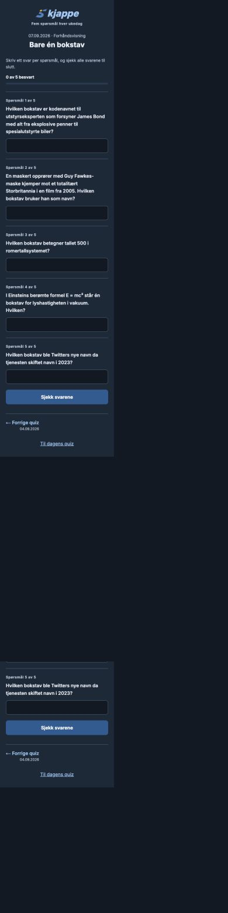
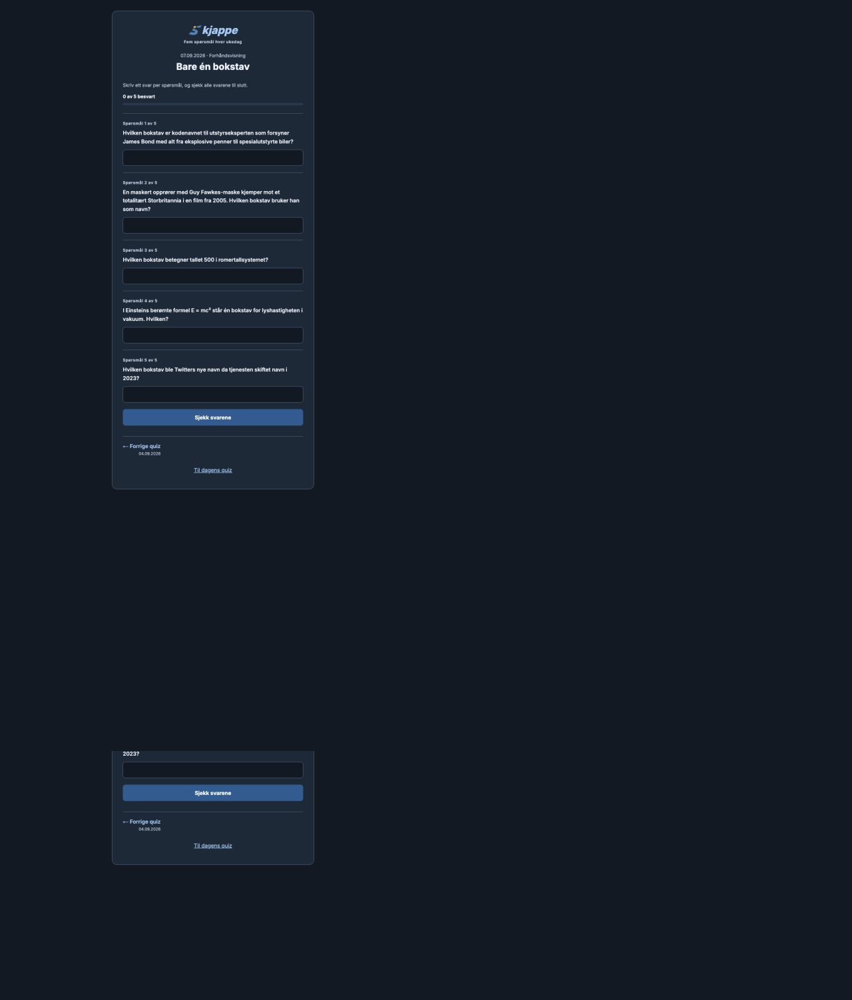
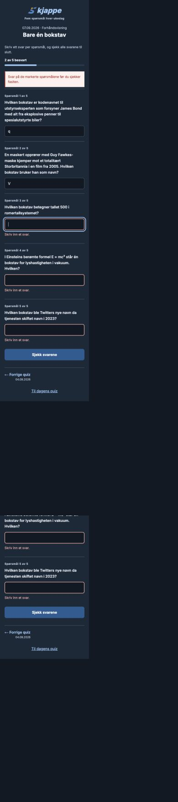

# Quiz usability audit

Audited 6 September 2026 against `23e7588`, using the real five-question quiz for 7 September. The improvements preserve the existing answer tolerance, including deliberate whitespace padding, and the existing UTC statistics day.

## Findings and decisions

| Priority | Before | After | Why |
| --- | --- | --- | --- |
| High | Inputs had no labels; the document language was English. | Every input has a question label, validation description, and visible focus; document language is Norwegian Bokmål. | Keyboard and assistive-technology users can identify the question and recover from errors. |
| High | The submit button invoked submission through both `onClick` and the form. Sparse answer arrays could bypass `.some()` validation. | One form submission path with an immediate ref guard; validate every question index and focus the first missing answer. | Prevent duplicate submissions and accidental grading of incomplete answers. |
| High | Archive scores were posted to an API that assigns every score to today. | Only today's quiz posts statistics; other dates explain that their results stay out of today's statistics. | Keep historical play from distorting the daily comparison. |
| High | Result text and buttons had low contrast; no overall personal score was displayed. | Prominent score, explicit correct/incorrect labels, readable answer panels and fasit for every question. | Make the outcome understandable without counting symbols or relying on color. |
| Medium | A request failure looked like “no questions today”; a rejected statistics submission was only logged. | Separate loading, missing-quiz and retry states; visible registration status while preserving the local result. | Distinguish an empty day from a technical problem and explain what the user can do. |
| Medium | Drafts disappeared on reload; the home page, dated routes and ISO query links used different saved-answer keys. | Save drafts per normalized date; restore completed answers across route formats; read legacy completion keys and ignore malformed data. | Avoid losing work or making a completed quiz appear unplayed. |
| Medium | On a missing day, “previous” could point at the latest file, even if that date was in the future. | Find chronological neighbors, show dates, offer a previous-quiz action on empty days, and a home link on dated pages. | Keep archive navigation predictable. |
| Medium | Copy success used a one-second modal with no dialog semantics; copy failures were invisible. | Persistent inline confirmation and a selectable text fallback; shares always use the dated quiz URL. | Give readers time to perceive feedback and keep shared results attached to the intended quiz. |
| Medium | Questions had no numbering or completion indication; the date competed with the logo in a single heading. | Separate branding, date and theme; number questions and show completion progress; 48px inputs and primary buttons. | Improve orientation and touch use while retaining the familiar single-page quiz. |

## Before and after

All screenshots are local renders in dark mode with the same question content. Mobile comparison: 390px wide; desktop: 1280px wide. Full-page images intentionally show the added vertical spacing; the tradeoff is more scrolling for clearer grouping and larger controls.

| Mobile before | Mobile after |
| --- | --- |
|  |  |

| Desktop before | Desktop after |
| --- | --- |
|  |  |

| Validation before | Validation after |
| --- | --- |
|  |  |

Additional states: [results](after-results.png), [request failure](after-load-error.png), [empty Sunday](after-empty.png).

## Validation

- `npm test`: six regression tests covering padded single-letter grading, ordinary typo tolerance, normalized dates, missing-day navigation, corrupt storage data, and sparse/blank answer validation.
- `npm run lint`: no warnings or errors.
- `npx tsc --noEmit`: passed.
- `npm run build`: passed. Existing Browserslist-data freshness warning remains.
- Browser checks: 390px form and 320px results have no horizontal overflow; accessible question labels and Norwegian language are present.
- Empty submission marks five fields and moves focus to the first. Enter in the last field submits and moves focus to the result heading.
- Entered `q, V, A, C, X`: got 4/5, with A rejected and mixed-case answers accepted.
- Reloaded two draft answers: both restored. Opened the completed quiz through `?date=2026-09-07`: result restored from the dated route.
- Clipboard success copied the score, theme, date and `/20260907` link; confirmation stayed visible.
- Simulated a local questions API 500 using a temporary malformed quiz fixture. Retry recovered to the correct 404/empty-day state after removing the fixture. The fixture is not committed.
- A local proxy mocked the current-day quiz, statistics API and a failed POST. The score stayed visible, failure was explained, the existing string-formatted average rendered as 3.00/5, and the request counter was exactly one. No test submissions reached Firestore.
- Calculated CSS color-pair contrast: primary button 2.60:1 → 6.92:1; correct-answer text in light mode 2.12:1 → 7.37:1. Secondary copy is 6.23:1 in light mode and 8.56:1 in dark mode. This is a targeted contrast check, not a complete accessibility certification.

## Follow-up findings and limits

- Weekly statistics still treat zero correct answers as unplayed, and their streak logic counts calendar days instead of quiz days. That existing calculation needs a separate change with agreed streak semantics. This PR limits the weekly panel to the current Friday rather than showing it while reviewing an archive quiz.
- The UTC day is preserved to match the backend. Moving the product to Europe/Oslo midnight should update quiz selection, submissions, summaries and storage together.
- The clipboard-denial fallback and blocked-storage warning were code-reviewed but not reproduced in the browser. Native screen-reader and physical-device checks remain useful.
- No automatic retry for failed score registration: the backend has no idempotency key, so retrying after an ambiguous network failure could duplicate a score. The result is still available locally.
- The audit did not change the server-side grading/trust model or add an archive calendar. Those are separate scopes.
